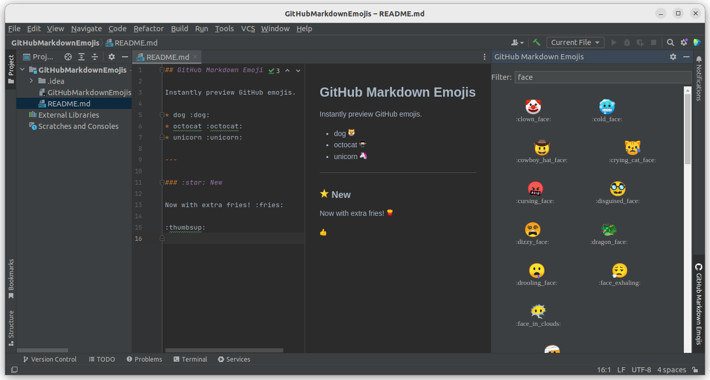

#  GitHub Markdown Emojis
> A plugin for the IntelliJ platform to instantly preview emojis of GitHub-flavoured markdown.

## Screenshot :camera:

## HowTo :book:

### Install :gear:

Use the IDE's built-in plugin system:

* `File` --> `Settings...` --> `Plugins` --> `Marketplace`
* search for: `GitHub Markdown Emojis`
* click the `Install`-button

Or go to the [plugin page](https://plugins.jetbrains.com/plugin/11988) on the [JetBrains](https://www.jetbrains.com)-website, download the archive-file and install manually.

### Use :partying_face:

There's nothing more to set up.  
Simply use the GitHub-emojis (e.g. `:smile:`) in your markdown file and active the preview window/pane.  
You should see the rendered images instead of just plain text.

### Build :hammer:

* clone the repo:  
`git clone https://github.com/4ch1m/github-markdown-emojis.git`
* change directory:  
`cd github-markdown-emojis`
* use the [Gradle](https://gradle.org)-wrapper to build the plugin: `./gradlew buildPlugin`
* a deployable ZIP file can then be found here: `./build/distributions/GitHub Markdown Emojis.zip`

## License :balance_scale:

Please read the [license](LICENSE) file.

## References :link:

* [Github Emoji API](https://api.github.com/emojis)
* [Emoji Cheat Sheet](https://github.com/ikatyang/emoji-cheat-sheet)

## Credits :star:

* Logo smiley taken from Microsoft's [Fluent Emoji](https://github.com/microsoft/fluentui-emoji) collection.
* Octocat silhouette in logo based on [johan](https://gist.github.com/johan/1007813)'s SVG.

## Disclaimer :point_up:

This project is not affiliated with or endorsed by [GitHub](https://github.com).
